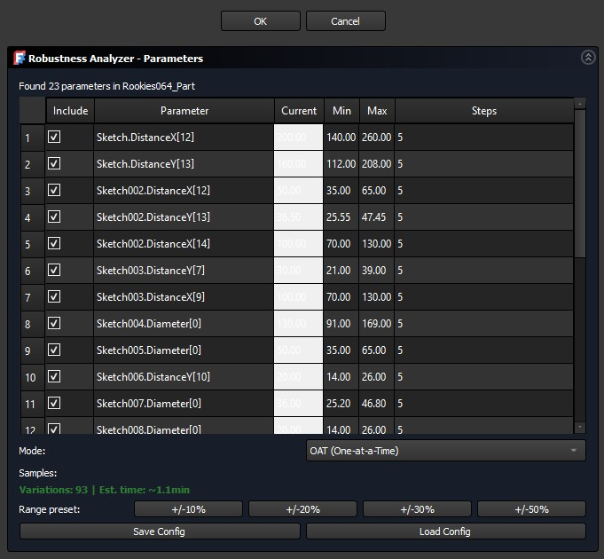
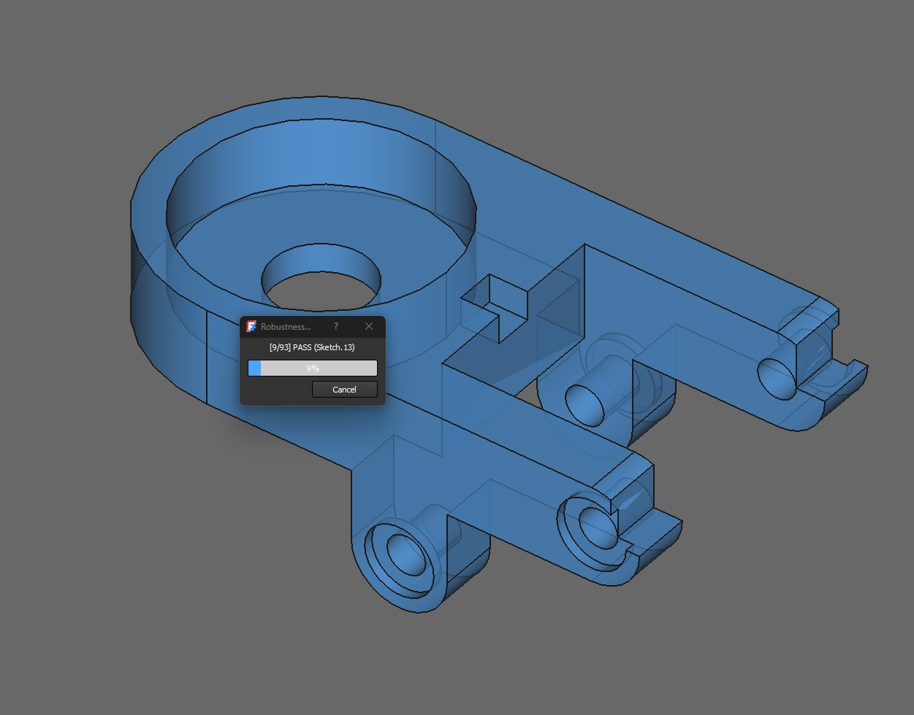
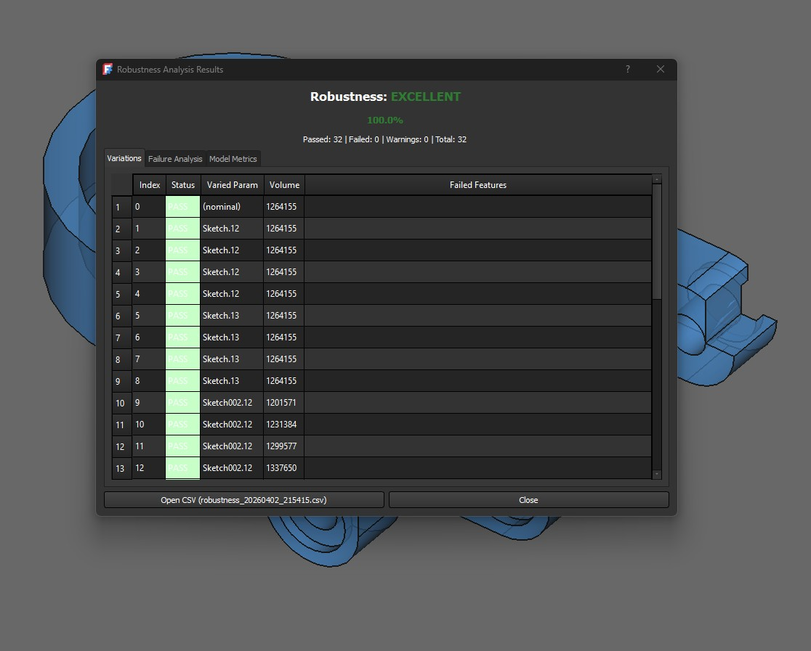
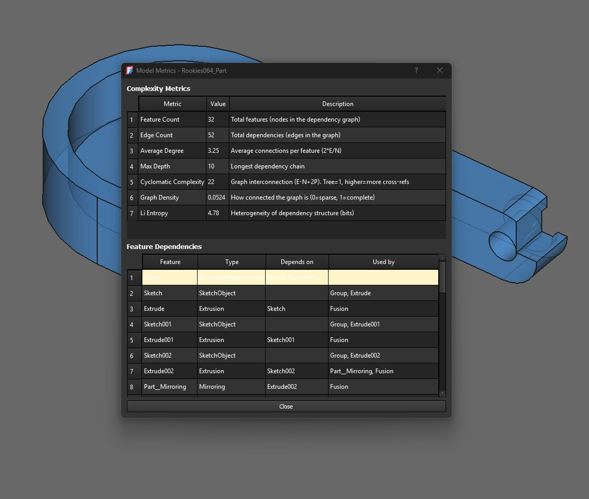

<!-- SPDX-License-Identifier: LGPL-2.1-or-later -->
<!-- SPDX-FileNotice: Part of the DesignProof addon. -->

# DesignProof - FreeCAD Workbench

Proof-test your parametric CAD models before they reach the shop floor.

DesignProof is a FreeCAD workbench that systematically varies the dimensional parameters of a model and checks whether FreeCAD can successfully regenerate the geometry. It identifies fragile features, quantifies model robustness, and helps you build parametric models that actually work across their intended design range.

Based on the parametric robustness methodology from [Aranburu et al. (2022)](#references) and [Otto & Mandorli (2024)](#references).

## Installation

### From the Addon Manager (recommended)

Open FreeCAD, go to **Edit > Preferences > Addon Manager**, search for **DesignProof**, and click Install.

### Manual installation

Copy the `DesignProof` folder to your FreeCAD Mod directory:

- **Windows**: `%APPDATA%/FreeCAD/Mod/`
- **Linux**: `~/.FreeCAD/Mod/`
- **macOS**: `~/Library/Preferences/FreeCAD/Mod/`

Restart FreeCAD. The workbench will appear in the workbench selector.

### Requirements

- FreeCAD 1.0 or later
- No external Python dependencies

## Screenshots

### Parameter Detection
Configure which parameters to vary, set custom ranges or use preset margins, and choose the variation mode.



### Running Analysis
The analysis runs variation by variation, showing real-time progress over the 3D model.



### Analysis Results
Results dialog with robustness rating, success rate, and detailed per-variation breakdown. Export to CSV for further analysis.



### Model Metrics
Standalone dependency analysis with complexity metrics (Li entropy, cyclomatic complexity, graph density) and full feature dependency table.



### Full Workflow


## Features

- **Automatic parameter detection** -- Sketch constraints (Distance, DistanceX, DistanceY, Radius, Diameter, Angle), extrusion properties (LengthFwd, LengthRev), and spreadsheet-driven parameters.
- **Three variation modes** -- One-at-a-Time (OAT), Full Factorial, and Random Sampling.
- **Interactive GUI** -- Parameter table with editable ranges, preset margins (+/-10%, 20%, 30%, 50%), save/load configuration as JSON.
- **Results dialog** -- Three tabs: Variations, Failure Analysis, and Model Metrics.
- **Model complexity metrics** -- Feature count, dependency graph density, cyclomatic complexity, Li entropy, maximum depth.
- **CSV report generation** -- Export detailed results for further analysis.
- **Robustness rating** -- EXCELLENT (>=90%), GOOD (>=70%), MODERATE (>=50%), POOR (>=25%), CRITICAL (<25%).

## How it works

In the default **OAT (One-at-a-Time)** mode, each parameter is varied independently while all others remain at their nominal values. For each parameter, the tool generates evenly spaced values between a configured minimum and maximum (e.g., +/-30% of the original value in 5 steps). After each change, FreeCAD recomputes the model and DesignProof checks every feature for errors. The **success rate** is the percentage of variations that regenerate without errors.

This approach isolates the effect of each parameter, making it straightforward to pinpoint which dimensions and features are fragile. Full Factorial and Random Sampling modes are available for more thorough or exploratory analysis.

## Usage

1. Open a parametric model (`.FCStd`) in FreeCAD.
2. Switch to the **DesignProof** workbench.
3. Click **Detect Parameters** to scan the model and configure variation ranges.
4. Adjust ranges or use a preset margin, select the variation mode, then click OK.
5. The analysis runs with a progress dialog. Results are presented in three tabs:
   - **Variations** -- Every parameter combination and its result.
   - **Failure Analysis** -- Which parameters and features cause failures.
   - **Model Metrics** -- Complexity and dependency metrics.
6. Use **Model Metrics** from the toolbar for standalone dependency analysis.

### Toolbar commands

| Command | Description |
|---------|-------------|
| Detect Parameters | Scan model, configure ranges and variation mode |
| Run Analysis | Execute variation test with progress dialog |
| Model Metrics | View dependency graph and complexity metrics |

### Headless usage

DesignProof can also be used from FreeCAD's command line (`FreeCADcmd`) for batch processing:

```python
import sys
import FreeCAD as App

sys.path.insert(0, "/path/to/DesignProof/freecad/DesignProof")
doc = App.openDocument("model.FCStd")

from core.parameter_detector import detect_parameters
from core.variation_engine import generate_variations, ParameterRange
from core.recompute_tester import RobustnessTester

params = detect_parameters(doc)
ranges = [ParameterRange(p.id, p.value * 0.7, p.value * 1.3, steps=5)
          for p in params if p.value > 0]
nominal = {p.id: p.value for p in params}
variations = generate_variations(ranges, mode="oat", nominal_values=nominal)

tester = RobustnessTester(doc)
results = tester.run(variations, {p.id: p for p in params})

passed = sum(1 for r in results if r.status == "PASS")
print(f"Success rate: {passed}/{len(results)} ({passed/len(results)*100:.1f}%)")
```

## Validated results

Tested on 5 models of varying complexity with FreeCAD 1.0.2 on Windows:

| Model | Type | Parameters | Variations | Success Rate | Rating |
|-------|------|-----------|------------|-------------|--------|
| Bracket (Rookies060) | PartDesign | 26 | 107 | 100.0% | EXCELLENT |
| Flange (Rookies062) | PartDesign | 14 | 58 | 100.0% | EXCELLENT |
| Lever (Rookies063) | PartDesign | 20 | 81 | 100.0% | EXCELLENT |
| Part (Rookies064) | Part WB | 23 | 93 | 100.0% | EXCELLENT |
| TestModel | PartDesign | 7 | 29 | 93.1% | EXCELLENT |

Test models sourced from the FreeCAD Rookies series by Paulo Ferreira 3D (GrabCAD). Mode: OAT, +/-30%, 5 steps. Not yet tested on Linux or macOS -- feedback from other platforms is welcome.

## Known limitations

- Only detects dimensional parameters (sketch constraints and extrusion properties). Booleans, enumerations, and placement parameters are not yet supported.
- Does not detect parameters driven by Python expressions or linked to external files.
- Full Factorial mode can be very slow with many parameters (exponential growth).
- Fillet and Chamfer features are commonly the most sensitive to parameter changes -- in the test set used, they account for most regeneration failures.
- Currently tested only on Windows with FreeCAD 1.0.2.

## Roadmap

The goal is for DesignProof to become a comprehensive design verification toolkit. Future directions:

- Geometric validation (self-intersections, degenerate edges)
- Manufacturability checks (wall thickness, draft angles, undercuts)
- Tolerance stack-up analysis
- Assembly verification (interference, clearance)
- Design rule engine (configurable checks)
- Batch processing and HTML/PDF reports

All ideas are welcome -- open an [issue](https://github.com/Unai-Pz-de-A/FreeCAD-DesignProof/issues) or see [Contributing](#contributing) below.

## References

This work is based on the methodology described in:

- Aranburu, A., Cotillas, M., Justel, D., Contero, M., & Camba, J. D. (2022). *"How Does the Modeling Strategy Influence Design Optimization and the Automatic Generation of Parametric Geometry Variations?"* Computer-Aided Design, 151, 1-13. [DOI: 10.1016/j.cad.2022.103345](https://doi.org/10.1016/j.cad.2022.103345)

- Otto, H. E., & Mandorli, F. (2024). *"Data-Driven Assessment of Parametric Robustness of CAD Models."* Proceedings of CAD'24, Eger, Hungary.

## Contributing

This workbench is maintained by [Unai Pz de A](https://github.com/Unai-Pz-de-A), a freelance mechanical design engineer. I'm not a software developer -- I built this with the help of [Claude Code](https://claude.ai/claude-code) to solve a real problem: parametric models that look solid until someone changes a dimension and everything breaks.

**This is my first open-source project.** If I could build it, you can contribute too. Every contribution matters, whether it's:

- Reporting a bug or a model that produces unexpected results
- Testing on Linux or macOS
- Suggesting a new verification feature
- Improving the code, documentation, or translations
- Sharing your test results with different models

Open an [issue](https://github.com/Unai-Pz-de-A/FreeCAD-DesignProof/issues) or submit a pull request. No contribution is too small.

## License

[LGPL 2.1](https://www.gnu.org/licenses/old-licenses/lgpl-2.1.html)
